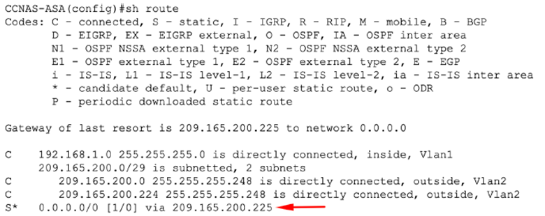
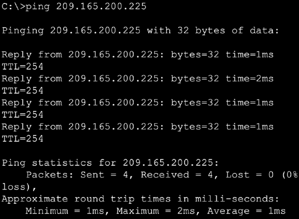
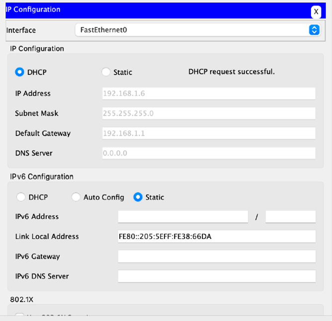
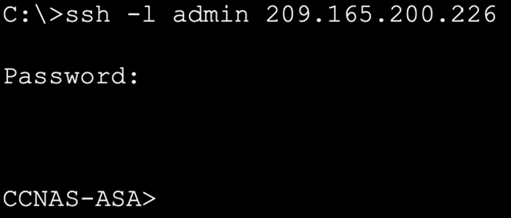

-- LAB : Configuring ASA Basic Settings and Firewall Using CLI --

1 ) ตั้งค่า Router R1
  
  Router>en
  
  Router#conf t
   
  Router(config)#hostname R1
  
  R1(config)#

1.1) ตั้งค่า password enable mode
  
  R1(config)#enable secret enpass

1.2) ตั้งค่า console และ ssh
  
  R1(config)#line con 0
  
  R1(config-line)#password P@ssw0rd
  
  R1(config-line)#login
  
  R1(config-line)#exit

1.3) ตั้งค่าการ Remote เข้ามาอุปกรณ์ (Telnet/SSH) จำนวน 5 ช่องพร้อมกัน
  
  R1(config)#line vty 0 4
  
  R1(config-line)#password telnetpass
  
  R1(config-line)#login
 
  R1(config-line)#exit
  
  R1(config)#

1.4 ) ตั้งค่า g 0/0
  
  R1(config)#int g0/0
  
  R1(config-if)#ip address 209.165.200.225 255.255.255.248
  
  R1(config-if)#no shut

1.5 ) ตั้งค่า R1 ให้เชื่อมต่อกับ R2 และ s0/0/0
  
  R1(config)#int s0/0/0
  
  R1(config-if)#ip address 10.1.1.1 255.255.255.252
  
  R1(config-if)#clock rate 64000
 
  R1(config-if)#no shut

*** ตั้งค่า default  route ***
  
  R1(config)#ip route 0.0.0.0 0.0.0.0 Serail0/0/0

 

 2. ตั้งค่า Router R2
  
  Router>en
  
  Router#conf t
  
  Router(config)#hostname R2
  
  R2(config)#

2.1 ) ตั้งค่า Password ให้ R2
  
  R2(config)#enable secret enpass
2.2 ) ตั้งค่า console และ ssh
  
  R2(config)#line con 0
  
  R2(config-line)#password P@ssw0rd
  
  R2(config-line)#login
  
  R2(config-line)#exit

2.3 ) ตั้งค่าการ Remote เข้ามาอุปกรณ์ (Telnet/SSH) จำนวน 5 ช่องพร้อมกัน
  
  R2(config)#line vty 0 4
  
  R2(config-line)#password sshpass
 
  R2(config-line)#login
  
  R2(config-line)#exit
  
  R2(config)#

2.4 ) ตั้งค่า R2 ให้เชื่อมต่อกับ R1 และ s0/0/0
  
  R2(config)#int s0/0/0
  
  R2(config-if)#ip address 10.1.1.2 255.255.255.252
  
  R2(config-if)#no shut

2.5 ) ตั้งค่า R2 ให้เชื่อมต่อกับ R3 และ s0/0/1
  
  R2(config)#int s0/0/1
  
  R2(config-if)#ip address 10.2.2.2 255.255.255.252
  
  R2(config-if)#clock rate 64000
 
  R2(config-if)#no shut

2.6 ) ตั้งค่า static route
  
  R2(config)#ip route 172.16.3.0 255.255.255.0 Serial0/0/1
  
  R2(config)#ip route 209.165.200.224 255.255.255.248 Serial0/0/0

 

3. ) ตั้งค่า Router R3

  Router>en
  
  Router#conf t
  
  Router(config)#hostname R3
  
  R3(config)#

3.1 ) ตั้งค่า Password ให้ R3
  
  R3(config)#enable secret enpass

3.2 ) ตั้งค่า console และ ssh
  
  R3(config)#line con 0
  
  R3(config-line)#password P@ssw0rd
  
  R3(config-line)#login
  
  R3(config-line)#exit

3.3 ) ตั้งค่าการ Remote เข้ามาอุปกรณ์ (Telnet/SSH) จำนวน 5 ช่องพร้อมกัน
  
  R3(config)#line vty 0 4
  
  R3(config-line)#password telnetpass
  
  R3(config-line)#login
  
  R3(config-line)#exit
  
  R3(config)#

3.4 )ตั้งค่า g0/1
  
  R3(config)#int g0/1
  
  R3(config-if)#ip address 172.16.3.1 255.255.255.0
  
  R3(config-if)#no shut

3.5) ตั้งค่า R3 ให้เชื่อมต่อกับ R2 และ s0/0/1
  
  R3(config)#int s0/0/1
  
  R3(config-if)#ip address 10.2.2.1 255.255.255.252
  
  R3(config-if)#no shut

*** ตั้งค่า default  route ***
  
  R3(config)#ip route 0.0.0.0 0.0.0.0 Serial0/0/1

  
4. ) การกำหนดค่า ASA และความปลอดภัยของ Interface ผ่าน CLI

4.1 ) กำหนดค่า hostname และ domain name โดยใช้คำสั่ง

  ciscoasa>en

  ciscoasa#conf t
  
  ciscoasa(config)#hostname CCNAS-ASA

  CCNAS-ASA(config)#domain-name cybersecurity.com

4.2 ) ตั้งค่ารหัสผ่านสำหรับ Enable Mode

  CCNAS-ASA(config)#enable password enpass

4.3 ) ตั้งค่า Interface ภายใน (inside) และภายนอก (outside) กำหนดค่า Interface VLAN 1 แบบ logical สำหรับเครือข่าย inside (192.168.1.0/24) ให้ตั้งค่า security level (ระดับความปลอดภัย) ให้เป็นค่าสูงสุดที่ 100 โดยใช้คำสั่ง

  CCNAS-ASA(config)# interface vlan 1

  CCNAS-ASA(config-if)# nameif inside

  CCNAS-ASA(config-if)# ip address 192.168.1.1 255.255.255.0

  CCNAS-ASA(config-if)# security-level 100

  CCNAS-ASA(config-if)# exit

  CCNAS-ASA(config)#

4.4 ) สร้าง Interface VLAN 2 แบบ logical สำหรับเครือข่าย outside (209.165.200.224/29) ให้ตั้งค่า security level (ระดับความปลอดภัย) ให้เป็นค่าต่ำสุดที่ 0 และ enable (เปิดใช้งาน) Interface VLAN 2 โดยใช้คำสั่ง

  CCNAS-ASA(config)#interface vlan 2

  CCNAS-ASA(config-if)#nameif outside

  CCNAS-ASA(config-if)#ip address 209.165.200.226 255.255.255.248

  CCNAS-ASA(config-if)#security-level 0
  
  CCNAS-ASA(config-if)#exit
  
  CCNAS-ASA(config)#

  CCNAS-ASA#sh switch vlan

5 ) การกำหนดค่า Routing, Address Translation และ Inspection Policy กำหนดค่า Static Default Route สำหรับ ASA สร้าง Default Route แบบ "quad zero" (0.0.0.0 0.0.0.0)  เชื่อมโยง route นี้กับ interface outside ของ ASA ชี้ไปที่ IP Address 209.165.200.225 (ซึ่งเป็นขา G0/0 ของ R1) ให้เป็น gateway of last resort (เกตเวย์ทางออกสุดท้าย)

โดยใช้คำสั่ง

  CCNAS-ASA(config)#route outside 0.0.0.0 0.0.0.0 209.165.200.225

ตรวจสอบ Routing

  CCNAS-ASA(config)#sh route

6 ) กำหนดค่า Address Translation โดยใช้ PAT และ Network Objects สร้าง network object ชื่อ inside-netและกำหนดคุณสมบัติ (attributes) ให้กับ object นี้ โดยใช้คำสั่ง subnet และ nat

  CCNAS-ASA(config)#object network inside-net

  CCNAS-ASA(config-network-object)#subnet 192.168.1.0 255.255.255.0

  CCNAS-ASA(config-network-object)#nat (inside,outside) dynamic interface

  CCNAS-ASA(config-network-object)#end

7 ) ปรับแต่ง Global Service Policy สำหรับ MPF Application Inspection สำหรับการตรวจสอบ Application Layer (Application Layer Inspection) และ option ขั้นสูงอื่นๆ, Cisco ASA จะใช้สิ่งที่เรียกว่า MPF (Modular Policy Framework) สร้าง class-map, policy-map, และ service-policyให้เพิ่มการ inspection (ตรวจสอบ) traffic ประเภท ICMP เข้าไปในรายการของ policy map

โดยใช้คำสั่ง

  CCNAS-ASA(config)#class-map inspection_default

  CCNAS-ASA(config-cmap)#match default-inspection-traffic

  CCNAS-ASA(config-cmap)#exit

  CCNAS-ASA(config)#policy-map global_policy

  CCNAS-ASA(config-pmap)#class inspection_default

  CCNAS-ASA(config-pmap-c)#inspect icmp

  CCNAS-ASA(config-pmap-c)#exit

  CCNAS-ASA(config)#service-policy global_policy global

8 ) กำหนดค่า DHCP, AAA และ SSH ตั้งค่า ASA ให้เป็น DHCP Server (Configure the ASA as a DHCP server) กำหนดค่าพูลที่อยู่ DHCP (DHCP address pool) และเปิดใช้งาน (enable) บน interface 'inside' ของ ASA  ด้วยคำสั่ง

  CCNAS-ASA(config)#dhcpd address 192.168.1.5-192.168.1.36 inside

เปิดใช้งาน DHCP daemon (บริการ DHCP) ภายใน ASA เพื่อให้ ASA เริ่ม รอรับคำร้องขอ DHCP จาก Client (DHCP client requests) ที่ส่งเข้ามาทาง Interface ที่เปิดใช้งานไว้ (ในที่นี้คือ Interface inside) ด้วยคำสั่ง

  CCNAS-ASA(config)#dhcpd dns 209.165.201.2 interface inside

  CCNAS-ASA(config)#dhcpd enable inside

9 )  กำหนดค่า AAA ให้ใช้ฐานข้อมูล local (local database) สำหรับการยืนยันตัวตน กำหนด (สร้าง) user local ชื่อ admin โดยป้อนคำสั่ง username และกำหนดรหัสผ่าน (password) เป็น admincybergen6

CCNAS-ASA(config)#username admin password admincybergen6

9.1 ) กำหนดค่า AAA ให้ใช้ฐานข้อมูล local ของ ASA (local ASA database) สำหรับการยืนยันตัวตนของผู้ใช้ SSH (SSH user authentication)

CCNAS-ASA(config)#aaa authentication ssh console LOCAL

10 ) กำหนดค่าการเข้าถึง ASA จากระยะไกล (Remote Access)

สร้างคู่คีย์ RSA (Generate an RSA key pair) ซึ่งจำเป็นสำหรับการรองรับการเชื่อมต่อ SSH

  CCNAS-ASA(config)#crypto key generate rsa modulus 1024

กำหนดค่า ASA ให้รองรับการเชื่อมต่อ SSH อนุญาตการเชื่อมต่อ จากโฮสต์ใดก็ได้ บนเครือข่าย inside (192.168.1.0/24) อนุญาตการเชื่อมต่อ จากโฮสต์ที่ใช้จัดการระยะไกล ที่สาขา (172.16.3.3) ซึ่งอยู่บนเครือข่าย outside ตั้งค่า SSH timeout เป็น 10 นาที (ค่า default คือ 5 นาที)  ด้วยคำสั่ง

  CCNAS-ASA(config)#ssh 192.168.1.0 255.255.255.0 inside

  CCNAS-ASA(config)#ssh 172.16.3.3 255.255.255.255 outside

  CCNAS-ASA(config)#ssh timeout 10

 
SSH จากเครื่อง PC-C ไปยัง ASA (209.165.200.226)
 

SSH จากเครื่อง PC-B ไปยัง ASA (192.168.1.1)

C:\>ssh -l admin 192.168.1.1

11 ) การกำหนดค่า DMZ, Static NAT และ ACLs

ตั้งค่า ASA และความปลอดภัยของอินเทอร์เฟซโดยใช้ CLI กำหนดค่าชื่อโฮสต์และชื่อโดเมน กำหนดค่า Interface DMZ (VLAN 3) บน ASA กำหนดค่า DMZ VLAN 3 ซึ่งเป็นโซนที่ Web Server (ที่ให้บริการ public) จะถูกติดตั้งอยู่ กำหนด IP Address เป็น 192.168.2.1/24 ตั้งชื่อเป็น dmz กำหนด security level (ระดับความปลอดภัย) เป็น 70 เนื่องจาก Server (ใน DMZ) ไม่จำเป็นต้องเป็นฝ่ายเริ่มต้นการสื่อสาร (initiate communication) ไปยัง user ฝั่ง inside (VLAN 1) ด้วยคำสั่ง

  CCNAS-ASA(config)#interface vlan 3

  CCNAS-ASA(config-if)#ip address 192.168.2.1 255.255.255.0

  CCNAS-ASA(config-if)#no forward interface vlan 1

  CCNAS-ASA(config-if)#nameif dmz

INFO:Security level for "dmz" set to 0 by default.

  CCNAS-ASA(config-if)#security-level 70

  CCNAS-ASA(config-if)#exit

  CCNAS-ASA(config)#

 
กำหนด (Assign) interface E0/2 ของ ASA ให้อยู่ใน DMZ VLAN 3 และเปิดใช้งาน (enable) interface นี้

  CCNAS-ASA(config)#interface Ethernet0/2

  CCNAS-ASA(config-if)#switchport access vlan 3

  CCNAS-ASA(config-if)#exit

  CCNAS-ASA(config)#sh ip

  CCNAS-ASA(config)#show switch vlan

12 ) กำหนดค่า Static NAT ไปยัง Server ใน DMZ โดยใช้ Network Object

กำหนดค่า network object ชื่อ dmz-server ภายใน object กำหนด IP address ของ Server ใน DMZ ให้เป็น 192.168.2.3 และใช้คำสั่ง nat เพื่อกำหนดค่า Static NAT โดยระบุว่า เป็นการแปล address ระหว่างโซน (dmz,outside) ให้แปลไปเป็น Public Address 209.165.200.227  โดยใช้คำสั่ง

  CCNAS-ASA(config)#object network dmz-server

  CCNAS-ASA(config-network-object)#host 192.168.2.3

  CCNAS-ASA(config-network-object)#nat (dmz,outside) static 209.165.200.227

  CCNAS-ASA(config-network-object)#exit

 

13 ) กำหนดค่า Access List (ACL) เพื่ออนุญาตให้ (เครื่องจาก) อินเทอร์เน็ต เข้าถึง Server ใน DMZ ได้

กำหนดค่า named access list ชื่อ OUTSIDE-DMZ โดยอนุญาต protocol TCP บน port 80 (HTTP) จากโฮสต์ภายนอกใดก็ได้ ไปยัง IP Address ภายใน (internal IP) ของ Server ใน DMZ นำ Access List นี้ไปใช้งานกับ Interface outside ของ ASA ในทิศทาง "IN" (ขาเข้า) ด้วยคำสั่ง

  CCNAS-ASA(config)#access-list OUTSIDE-DMZ permit icmp any host 192.168.2.3

  CCNAS-ASA(config)#access-list OUTSIDE-DMZ permit tcp any host 192.168.2.3 eq 80

  CCNAS-ASA(config)#access-group OUTSIDE-DMZ in interface outside

