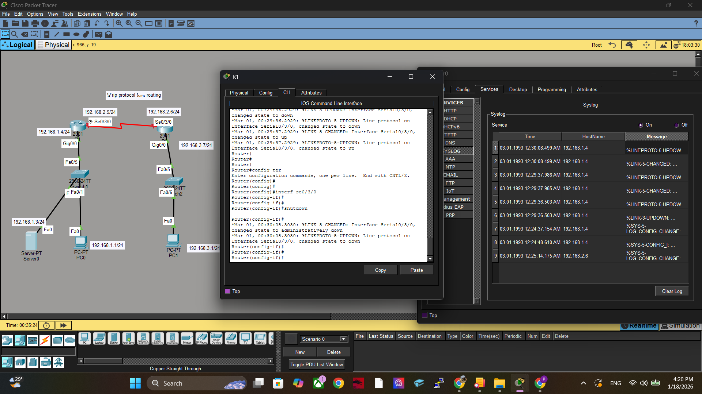

# Lab 3: Configure Router to log messages to the syslog server using the CLI.

- เพิ่ม Timestamp เพื่อความแม่นยำของเวลาใน log

- ส่ง log ออกไปยัง Syslog Server (192.168.1.3)

- ตั้งค่า severity level (information) เพื่อบันทึก log ที่สำคัญในระดับข้อมูลทั่วไป

- เก็บ log ใน buffer ของ router (16,000 bytes) สำหรับตรวจสอบทันทีโดยไม่ต้องพึ่ง Syslog Server

ผลลัพธ์:

1 ) ผู้ดูแลระบบสามารถดู log ได้ทั้งใน Router (show logging) และที่ Syslog Server

2 ) รองรับทั้ง Local Logging + Remote Logging

3 ) เป็นการจัดการ Log แบบรวมศูนย์เพื่อเพิ่มความปลอดภัยและง่ายต่อการตรวจสอบ

#### กำหนดค่าเราเตอร์และสวิตช์เพื่อส่งบันทึกไปยังเซิร์ฟเวอร์ Syslog

R1>en

R1#configure terminal

R1(config)#service timestamps log datetime msec */เพิ่ม Timestamp ลงในทุก log message?
ใช้รูปแบบ วัน-เวลา-มิลลิวินาที
ทำให้ log มีความละเอียด สามารถตรวจสอบเหตุการณ์ย้อนหลังได้แม่นยำ?*

R1(config)#logging 192.168.1.3 */ระบุ Syslog server ที่ IP 192.168.1.3Router จะ forward log ไปยัง server เพื่อเก็บรวมศูนย์ /*

ประโยชน์:

- ลดภาระการเก็บ log บนอุปกรณ์เครือข่าย

- ง่ายต่อการวิเคราะห์เหตุการณ์ (เช่น Security Incident)

R1(config)#loggin trap ?

